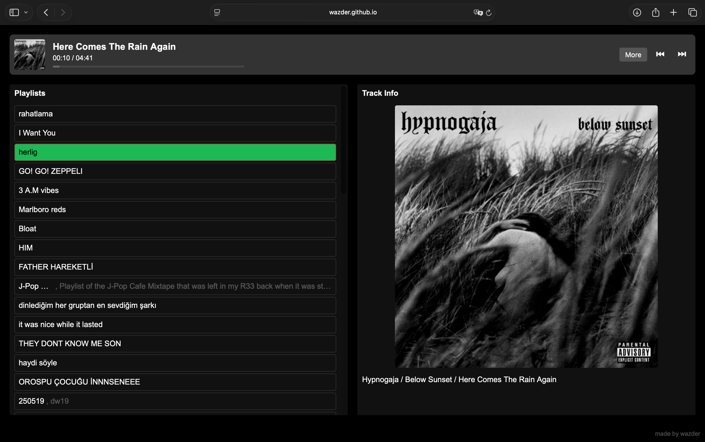

# wazder’s Spotify Controller

A lightweight, client-side Spotify controller built with vanilla JavaScript, HTML and CSS.  
Control your Spotify playback, browse playlists and tracks, and view detailed track info—all without leaving your browser.


## Features

- **Spotify Authentication**  
  Uses PKCE flow to authenticate with Spotify’s API.
- **Now Playing Display**  
  Shows current track’s artwork, title, artist/album info, and playback progress.
- **Playback Controls**  
  Play, pause, skip forward/backward directly from the web interface.
- **Playlist & Track Browsing**  
  Load your playlists (paginated) and view/scroll through tracks.
- **Detailed Track Info**  
  Toggle a “More” view to see full album art and metadata.
- **Responsive, Dark-themed UI**  
  Full-screen experience with mobile-friendly viewport settings.

## Demo

> demo video : https://youtu.be/qJLQCKLno9c

> 

## Getting Started

### Prerequisites

1. A Spotify Developer account (no payment required)  
3. A registered Spotify “Web” app with:
   - Redirect URI set to your own web service partner
     - Example : `https://wazder.github.io/spotify-controller/`
   - Client ID copied
   - 
    - You need to change this line with your own client id from https://developer.spotify.com

### Installation

```bash
# 1. Clone the repo
git clone https://github.com/wazder/spotify-controller.git
cd spotify-controller

# 2. (Optional) Serve with a simple HTTP server, e.g.:
npm install --global http-server
http-server -c-1 .  # disables caching

# 3. Open in browser:
#    http://localhost:8080 (or whatever port http-server shows)
